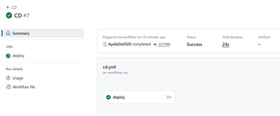
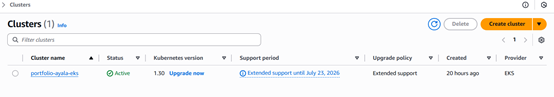
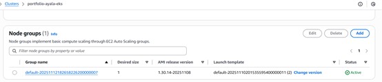
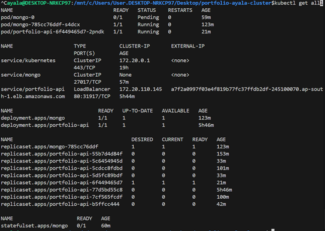
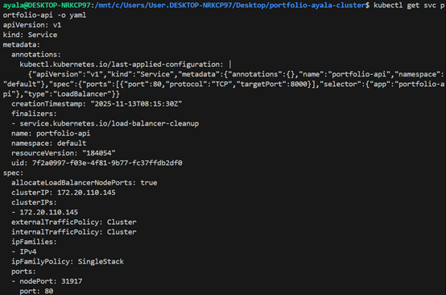
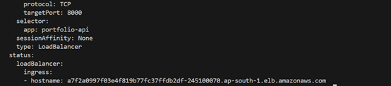
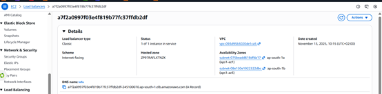

# Portfolio Ayala – Full DevOps Project  
Full-stack application with a complete CI/CD pipeline deployed on AWS EKS using Terraform + Kubernetes.

This repository contains:
- The Node.js application (Express + MongoDB)
- Docker configuration
- GitHub Actions CI & CD pipelines
- Full Kubernetes manifests
- Architecture diagram and deployment screenshots

---

# 📌 System Architecture

This diagram shows the entire flow:
- Developer pushes to GitHub  
- CI pipeline builds, tests, scans and publishes Docker images  
- CD pipeline deploys to EKS  
- AWS infrastructure: VPC, ECR, EKS, Load Balancer  
- Users access the application via ELB

---

# 🚀 CI Pipeline (GitHub Actions)

The CI workflow runs automatically on every push to `main`.

It performs:
1. **Pull**  
2. **Build** Docker image  
3. **Unit Test**  
4. **e2e Test** using docker-compose  
5. **Publish** image to Amazon ECR (latest + SHA tag)

### CI Screenshot  

---

# 🚀 CD Pipeline (GitHub Actions)

The CD workflow runs **automatically after CI succeeds**.

Steps:
1. GitHub assumes IAM Role using **OIDC**  
2. Builds the ECR image URI using commit SHA  
3. Updates kubeconfig for EKS  
4. Deploys the new version using:  
kubectl set image ...
kubectl rollout status ...

yaml
Copy code

### CD Screenshot  

---

# 🧱 AWS Infrastructure (Terraform)

Infrastructure is created in a separate repo (`portfolio-ayala-infra`), but relevant screenshots are included below.

### EKS Cluster  

### Node Group  

### ECR Repository  

---

# ☸ Kubernetes Deployment

The Kubernetes manifests (in `portfolio-ayala-cluster`) deploy:

- **API Deployment**  
- **Service (LoadBalancer)**  
- **MongoDB StatefulSet**

### kubectl get all  

### portfolio-api Service (LoadBalancer)  
  

### AWS Load Balancer  

---

# 🌍 Application Running in Production

Here is the application live through the AWS Load Balancer:

---

# 🧪 Run Locally

### ▶️ Run with Node.js

`npm install`
`npm run dev`

### ▶️ Run with Docker

`docker compose up`

### 📦 Deployment Flow Summary

1. Developer pushes new code
2. CI pipeline builds, tests, and publishes Docker images
3. Image is uploaded to Amazon ECR
4. CD workflow deploys the new version to EKS
5. Load Balancer exposes the updated application
6. Users access the app through the ELB DNS name

### 👩‍💻 Author
### Ayala Darshan
Full-Stack & DevOps Developer

GitHub: https://github.com/AyalaDa2020
