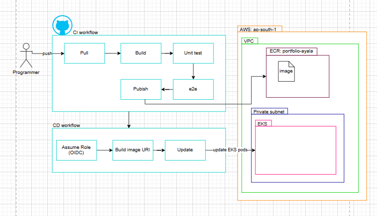
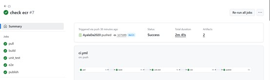

Portfolio-ayala

Full-stack Node.js application packaged with Docker and deployed automatically to AWS EKS using a CI/CD pipeline.

This repository contains the application code, Dockerfile, docker-compose, and the CI/CD workflows.

📌 Architecture (Diagram)

🚀 CI/CD Overview
✔ CI Pipeline

Triggered on every push to main:

Pull

Build Docker image

Unit tests

e2e tests (Docker Compose)

Publish image → AWS ECR

CI Screenshot:

✔ CD Pipeline

Runs automatically after CI succeeds:

GitHub Actions assumes AWS IAM Role (OIDC)

Generates image URI (using commit SHA)

Updates EKS Deployment

Waits for rollout success

CD Screenshot:

🧱 Tech Stack

Node.js / Express

Docker & Docker Compose

GitHub Actions

AWS ECR

AWS EKS

IAM OIDC (no static AWS keys)

🐳 Run Locally
npm install
npm start

or with Docker:

docker build -t portfolio-ayala .
docker run -p 8000:8000 portfolio-ayala

🌐 Main API Example

GET /api/clients – returns all clients
POST /api/clients – creates a new client

📂 Repository Structure
/src            → app logic
/static         → frontend files
Dockerfile
docker-compose.yml
.github/workflows/ci.yml
.github/workflows/cd.yml

✨ Author

Ayala Darshan
DevOps & Full-Stack Developer
GitHub: https://github.com/AyalaDa2020
